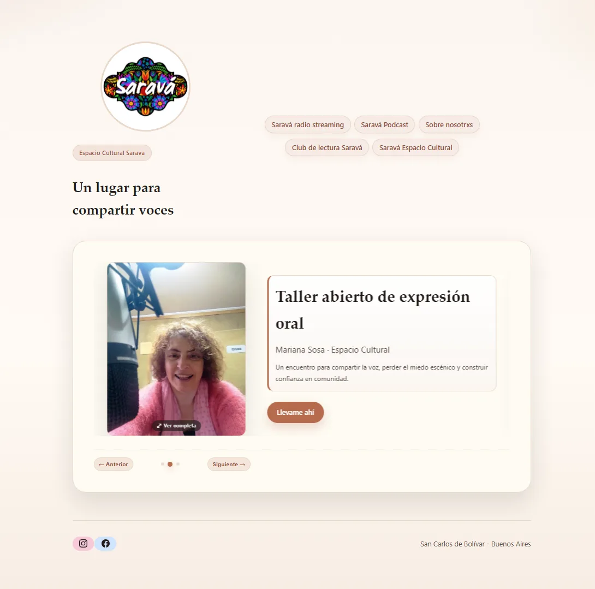
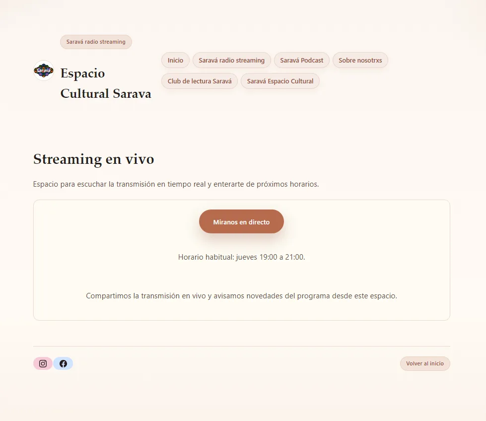
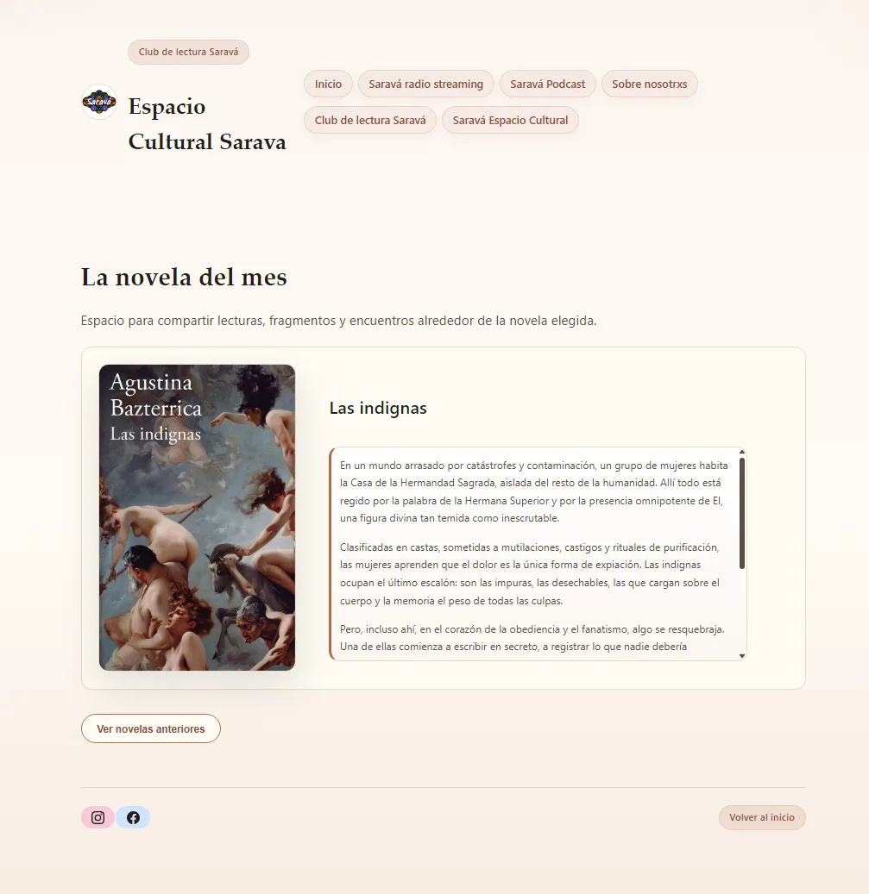
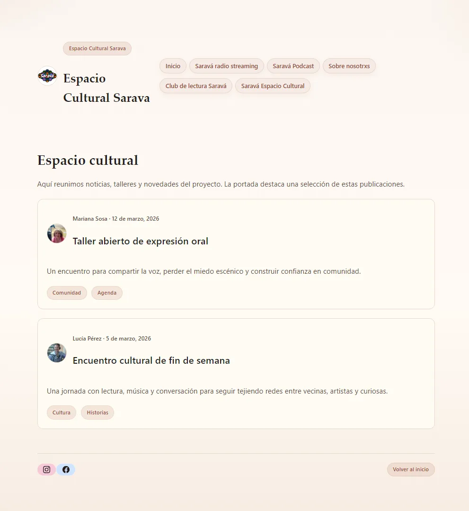

# Saravá — Espacio Cultural Saravá

[](.github/workflows/ci.yml) [](https://alejosworkstuff.github.io/sarava-radio-streaming/)

A Next.js site for **Espacio Cultural Saravá**, a community cultural space in San Carlos de Bolívar, Buenos Aires, Argentina. The site covers radio streaming, podcast, book club, cultural posts, and team information. Content is managed via versioned JSON files under `content/`.

**Live:** [alejosworkstuff.github.io/sarava-radio-streaming](https://alejosworkstuff.github.io/sarava-radio-streaming/)  
**Repo:** [github.com/alejosworkstuff/sarava-radio-streaming](https://github.com/alejosworkstuff/sarava-radio-streaming)

## Screenshots

| Home | Radio | Club de lectura | Espacio cultural |
|:---:|:---:|:---:|:---:|
|  |  |  |  |

---

## Problem and Context

The project needed a clear, maintainable web presence for a cultural community: multiple sections (radio, podcast, reading club, events), editable JSON content in Git, and static hosting without a Node server in production.

## My Role

- Built the Next.js App Router site with static export for GitHub Pages
- Implemented file-based content loading with TypeScript types
- Designed layout, hero carousel, and section pages
- Documented JSON content schemas and editing workflow in `content/README.md`
- Set up CI for lint and production build

---

## Tech Stack

- **Next.js 15** (App Router)
- **React 18**, **TypeScript 5.6**
- **Tailwind CSS 4** (+ custom CSS in `app/styles/`)
- **Static export** (`output: "export"` in `next.config.ts`)
- **GitHub Pages** — site served from the `docs/` folder on branch `master`

---

## Site Map

| Route | Page |
|-------|------|
| `/` | Home with hero carousel (book club, podcast, streaming highlights) |
| `/radio-streaming/` | Live streaming schedule and links |
| `/podcast/` | Podcast / YouTube channel |
| `/club-lectura/` | Novel of the month and reading club |
| `/espacio-cultural/` | Cultural posts (workshops, events, articles) |
| `/sobre-nosotras/` | About the space and team |

Navigation and branding live in `app/components/site-shell.tsx` (`SiteHeader`, `SiteFooter`).

---

## Architecture Overview

```text
sarava-project/
├── app/                    # App Router pages and components
│   ├── components/         # site-shell, hero-banner, cultural-posts
│   ├── styles/             # tokens, layout, components CSS
│   └── */page.tsx          # Section pages
├── content/                # JSON content (posts, novels, events)
│   └── README.md           # Content editor guide
├── lib/content.ts          # Type-safe loaders (server-only)
├── public/
│   ├── uploads/            # Site media
│   └── logo.jpg
├── docs/                   # Committed static export (GitHub Pages root)
├── next.config.ts          # basePath, static export, image settings
└── .github/workflows/ci.yml
```

### Content loading (`lib/content.ts`)

- `getPosts()` — Espacio Cultural posts (`content/posts/`)
- `getEvents()` / `getFeaturedEvent()` — events and transmisiones (`content/events/`)
- `getNovels()` / `getNovelOfTheMonth()` — club de lectura (`content/novels/`)

Content types: `PostEntry`, `EventEntry`, `NovelEntry`.

---

## Key Features

- Static export with production `basePath` `/sarava-radio-streaming` for GitHub Pages
- Hero banner carousel on the home page
- File-based JSON content versioned in Git (see `content/README.md`)
- Responsive layout and custom design tokens
- Spanish UI copy throughout

---

## Local Development

```bash
npm install
npm run dev
```

Open [http://localhost:3000](http://localhost:3000) (no `basePath` in development).

### Scripts

| Script | Purpose |
|--------|---------|
| `npm run dev` | Next.js dev server (Turbopack) |
| `npm run build` | Production static export to `out/` |
| `npm run build:pages` | Build and copy `out/` → `docs/` for GitHub Pages |
| `npm run lint` | ESLint |
| `npm run start` | Serve production build (if not using static export only) |

---

## Deploy to GitHub Pages

Production uses the **`docs/`** directory on branch **`master`** (not the default Next `out/` folder in git — `out/` is gitignored).

Typical workflow after changes:

```bash
npm run build:pages
# Commit content/ and docs/, then push to master
```

`next.config.ts` sets:

- `output: "export"`
- `basePath` / `assetPrefix`: `/sarava-radio-streaming` in production
- `trailingSlash: true`
- `images.unoptimized: true` (required for static export)

Site URL: `https://alejosworkstuff.github.io/sarava-radio-streaming/`

---

## Content editing

Content lives in `content/posts/`, `content/novels/`, and `content/events/` as JSON files. Edit directly in Git, run `npm run build:pages` (or `npm run build` plus copy to `docs/`), and push to `master` for GitHub Pages.

See **`content/README.md`** for schemas, field reference, and troubleshooting.

---

## CI

GitHub Actions (`.github/workflows/ci.yml`) on pull requests and pushes to **`master`**:

- `npm run lint`
- `npm run build`

Run locally:

```bash
npm install
npm run lint
npm run build
```

> Note: GitHub Actions may be temporarily unavailable due to account billing restrictions; the pipeline definition is valid and passes locally.

---

## Current Content (repository snapshot)

| Collection | Files |
|------------|--------|
| `content/posts/` | 2 posts |
| `content/novels/` | 1 novel (`las-indignas.json`, active) |
| `content/events/` | 1 event (`streaming-jueves.json`) |

Update this table when adding JSON files under `content/`.

---

## Case Study Highlights (Portfolio Use)

- **Challenge:** Multi-section cultural site with editor-friendly content and static hosting.
- **Approach:** Next.js static export + typed JSON loaders; GitHub Pages via committed `docs/`.
- **Result:** Live community hub with clear navigation and maintainable content workflow.

## What I Would Improve Next

- Automate `out/` → `docs/` copy in a release script or CI deploy job
- Re-enable or replace GitHub Actions deploy if account runners are available
- Add content validation script in CI (JSON schema per collection)
- Image optimization pipeline for uploads